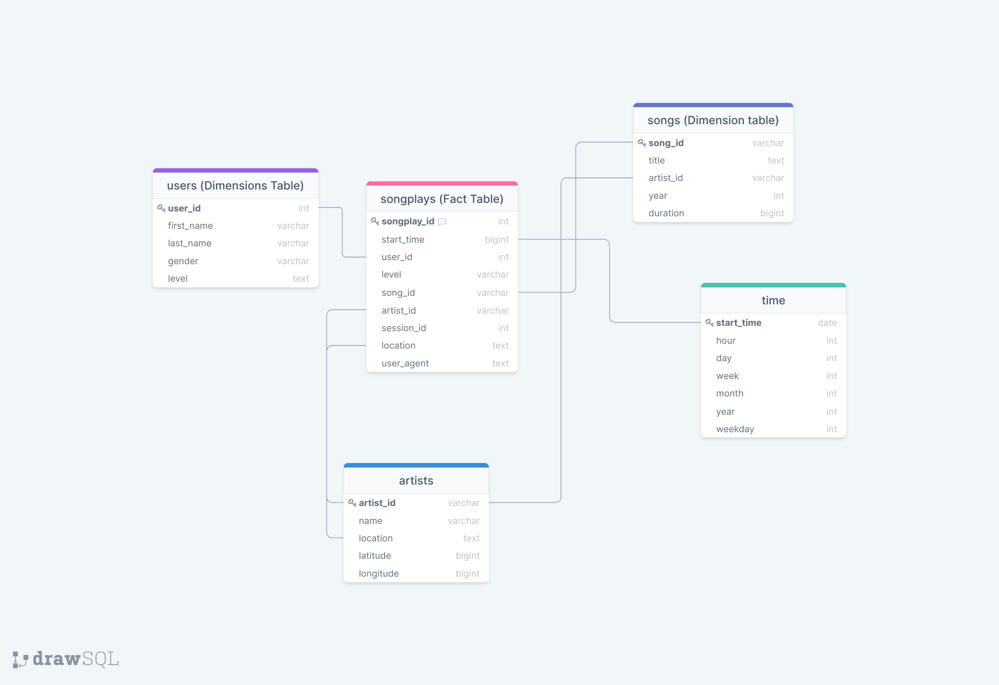

# Million Song Dataset
```by: Henry Melendez```


A postgres sql database that organizes a snippet of the million song data base into a star schema to analyze the difference in paid and free users by gender. which provides information for possible choices for marketing subscription based on gender.

# Prerequisites
``` 
Python 3
postgres SQL
pandas
os
glob
```

# Datasets
## Song Dataset
The first dataset is a subset of real data from the Million Song Dataset. Each file is in JSON format and contains metadata about a song and the artist of that song. The files are partitioned by the first three letters of each song's track ID. For example, here are filepaths to two files in this dataset:
```
song_data/A/B/C/TRABCEI128F424C983.json song_data/A/A/B/TRAABJL12903CDCF1A.json
```

And below is an example of what a single song file, TRAABJL12903CDCF1A.json, looks like.

``` {"num_songs": 1, "artist_id": "ARJIE2Y1187B994AB7", "artist_latitude": null, "artist_longitude": null, "artist_location": "", "artist_name": "Line Renaud", "song_id": "SOUPIRU12A6D4FA1E1", "title": "Der Kleine Dompfaff", "duration": 152.92036, "year": 0}
```

# Log Dataset
The second dataset consists of log files in JSON format generated by this event simulator based on the songs in the dataset above. These simulate activity logs from a music streaming app based on specified configurations.

The log files in the dataset I was working with are partitioned by year and month. For example, here are filepaths to two files in this dataset:
```
log_data/2018/11/2018-11-12-events.json log_data/2018/11/2018-11-13-events.json
```

# Database Schema for Song Play Analysis
Using the song and log datasets, I created a denormalized star schema optimized for fast agregations and simplified queries on song play analysis. This includes one fact table of songplays and four dimension tables for users, songs, artists, and time




# Files
```
create_tables.py
etl.ipynb
etl.py
sql_queries.py
test.ipynb
data(folder)
test.ipynb
```
# The steps to run the pipeline are as follows:

In a terminal, run python create_tables.py to reset the tables in the sparkifydb database.
Running test.ipynb (in a jupyter notebook) confirms that the tables were successfully created with the correct columns.
In a terminal, run python etl.py to process all the datasets.
Again, running test.ipynb confirms that the records were successfully inserted into each table.
Then running the test notebook to ensure data is in the database correctly.

in the terminal run:

```
python3 create_tables.py
```
then check the the tables and correct columns where create correctly with:
```
etl.py
```

# Running Tests

if etl.py is not inserting data into the table run:
```
create_tables.py
```
again and the use the note to run through the code line by line to isolate the error:
```
etl.ipynb
```
